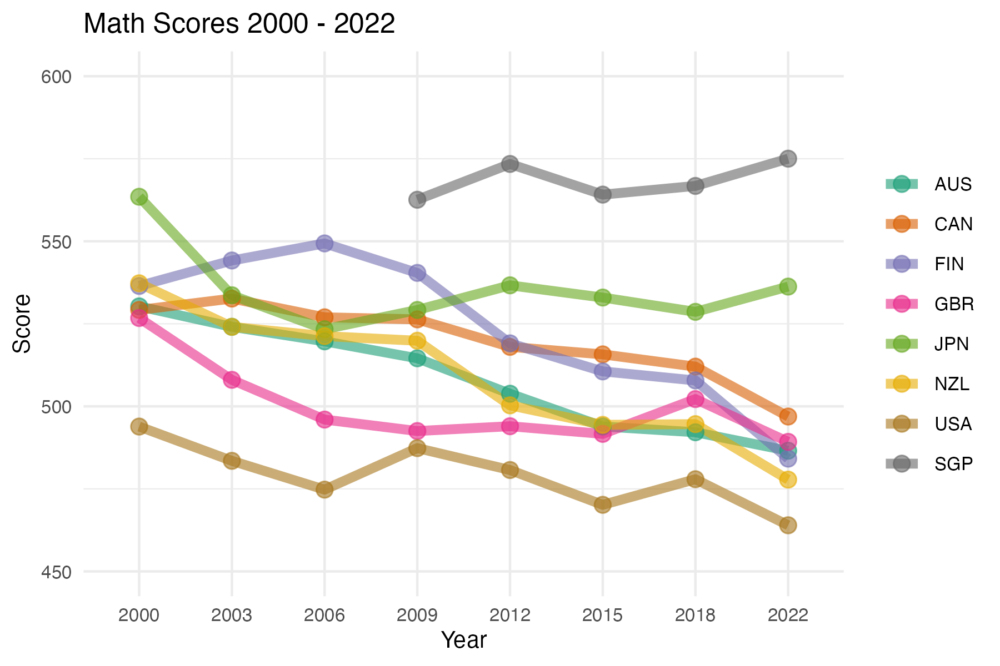

<!-- README.md is generated from README.Rmd. Please edit that file -->

```{r, include = FALSE}
knitr::opts_chunk$set(
  collapse = TRUE,
  warning = FALSE,
  message = FALSE,
  comment = "#>",
  fig.path = "man/figures/README-",
  out.width = "54%",
  fig.align = "center")
library(tidyverse)
library(learningtower)
```

# learningtower 


<!-- badges: start -->
[](https://github.com/kevinwang09/learningtower/actions/workflows/R-CMD-check.yaml)
<!-- badges: end -->

The goal of `learningtower` is to provide a user-friendly R package to provide easy access to a subset of variables from PISA data collected from the [OECD](https://www.oecd.org/pisa/data/), for the years 2000 - 2018, collected on a three year basis. This is an excellent dataset for exploring and visualizing data. This dataset can also be used for other analytically purposes as well as statistical computations.

## What is PISA?


<p align="center">
  
</p>


The Programme for International Student Assessment (PISA) is an international assessment measuring student performance in reading, mathematical and scientific literacy.

PISA assesses the extent to which 15-year-old students have acquired some of the knowledge and skills that are essential for full participation in society, and how well they are prepared for lifelong learning in the areas of reading, mathematical and scientific literacy.

In 2018, PISA involved 79 countries and 600,000+ students worldwide. 

Read more about the Programme [here](https://www.oecd.org/pisa/aboutpisa/).


## Installation

You can install the `learningtower` package from [CRAN](https://CRAN.R-project.org) with:

``` r
install.packages("learningtower")
```

To install the development version of `learningtower` from [GitHub](https://github.com/) use: 

``` r
devtools::install_github("kevinwang09/learningtower")
```

## Data Description and Usage


The `learningtower` gives access to a subset of variables from PISA data originally collected and are available from [OECD](https://www.oecd.org/pisa/data/), for the years 2000 - 2018, collected on a three year basis.

The `learningtower` package contains mainly three datasets:

+ `student`
+ `school`
+ `countrycode`

This provides us with information about the students scores in mathematics, reading and science. Their school details, and which country they are from. Let's have a look at how these datasets can be downloaded. 


### Student Dataset

The student dataset comprises of the scores from the triennial testing of 15-year-olds worldwide. In addition, this dataset contains interesting information on their parents qualifications, family wealth, gender, and possession of computers, internet, cars, books, rooms, desks, and similar other variables.

Keeping in mind the package's size constraints. The package only includes a portion of student data, called the student subset data, this subset of student data is available for all the years when the PISA experiment took place. The full year wise student data set can be downloaded using the `load_student()` function included in this package.

As an example, we can load the `student` data as follows:

- The student subset dataset can be loaded as follows

```{r}
library(learningtower)

# loading the student subset data for the year 2018
data(student_subset_2018)
head(student_subset_2018)
```

- The entire student data can be downloaded as follows:

```{r, eval=FALSE}
#load the entire student data for a single year
student_data_2018 <- load_student(2018)

#load the entire student data for two/three years (2000, 2012, 2018)
student_data_2012_2018 <- load_student(c(2012, 2018))
student_data_2000_2012_2018 <- load_student(c(2000, 2012, 2018))

#load the entire student data
student_data_all <- load_student("all")
```

See `?student_subset_2000` for information pertaining to variables captured.

### School Dataset

The school dataset comprises school weight and other information such as the funding distribution of the schools, whether the school is private or public, the enrollment of boys and girls, the school size, and similar other characteristics of interest of different schools these 15-year-olds attend throughout the world.

```{r}
# loading the school data
data(school)
head(school)
```

See `?school` for more information on the different variables present in the the school dataset.


### Countrycode Dataset

The countrycode dataset contains mapping of the [country ISO code to the country name](https://www.oecd.org/pisa/sitedocument/PISA-2015-Technical-Report-Readers-Guide.pdf). More information on the participating countries can be found [here](https://www.oecd.org/pisa/aboutpisa/pisa-participants.htm)

```{r}
# loading the countrycode data
data(countrycode)
head(countrycode)
```

See `?countrycode` for more detailed information on the countries that participated in the PISA experiment.

## Exploring the data 

In the plot shown below, shows the weighted mean of mathematics scores of these 15 year old students for a few selected countries over the available years.

```{r, eval = FALSE, echo = FALSE}
library(dplyr)
library(gganimate)
library(learningtower)

student <- load_student("all")

s <- student %>% 
  dplyr::filter(country %in% c("SGP","CAN", "FIN", "NZL", 
                               "USA", "JPN", "GBR", "AUS")) %>% 
  group_by(year, country) %>%
  summarise(math = weighted.mean(math, stu_wgt, na.rm=TRUE)) %>%
  ggplot(aes(x=year, y=math, group=country, color = country)) + 
  geom_line() +
  geom_point()+
  ylim(c(250,800)) + 
  theme_minimal() +
  labs(x = "Year",
       y = "Score",
       title = "Mathematics PISA Scores from 2000 - 2022")+ 
  theme(text = element_text(size=20)) +
  scale_color_brewer(palette = "Dark2") +
  view_zoom_manual(pause_length = 1,
                   step_length = 10, 
                   xmin = c(2000, 2022),
                   xmax = c(2000, 2022),
                   ymin =c(200, 450),
                   ymax = c(800, 600),
                   wrap = FALSE,
                   fixed_x = TRUE)

gif <- animate(s, 
               units="px", 
               width=800, 
               height=400, 
               pointsize=4, 
               res=100, 
               nframes=40)

anim_save(filename = "man/figures/readme.gif", animation = gif)

# Just use a static plot with the small range
student %>% 
  dplyr::filter(country %in% c("SGP","CAN", "FIN", "NZL", 
                               "USA", "JPN", "GBR", "AUS")) %>% 
  group_by(year, country) %>%
  summarise(math = weighted.mean(math, stu_wgt, na.rm=TRUE)) %>%
  ggplot(aes(x=year, y=math, group=country, color = country)) + 
  geom_line(alpha=0.6, linewidth = 2) +
  geom_point(alpha=0.6, size=3)+
  ylim(c(450, 600)) + 
  theme_minimal() +
  labs(x = "Year",
       y = "Score",
       title = "Math Scores 2000 - 2022") + 
  theme(text = element_text(size=10),
        legend.title = element_blank()) +
  scale_color_brewer(palette = "Dark2")
ggsave(filename = "man/figures/readme.png", width=1600, height=1200, units="px")
```

<p align="center">
  
</p>


- Similarly, you can find  more code examples and data visualizations for exploring `learningtower` through our vignettes and articles

- Further data exploration can be found in our articles exploring temporal trends [here](https://kevinwang09.github.io/learningtower/articles/articles/exploring_time.html).

## Citation

To cite the `learningtower` package, please use:

```{r}
citation("learningtower")
```

## Motivation for `learningtower` 

+ The PISA 2018 results were released on 3 December 2019. This led to wringing of hands in the Australian press, with titles of stories like [Vital Signs: Australia's slipping student scores will lead to greater income inequality](https://theconversation.com/vital-signs-australias-slipping-student-scores-will-lead-to-greater-income-inequality-128301) and [In China, Nicholas studied maths 20 hours a week. In Australia, it's three](https://www.smh.com.au/education/in-china-nicholas-studied-maths-20-hours-a-week-in-australia-it-s-three-20191203-p53ggv.html).

<p align="center">
  
</p>

+ Australia's neighbours, New Zealand and Indonesia, are also worrying: [New Zealand top-end in OECD's latest PISA report but drop in achievements 'worrying'](https://www.stuff.co.nz/national/education/117890945/new-zealand-topend-in-oecds-latest-pisa-report-but-drop-in-achievements-worrying), [Not even mediocre? Indonesian students score low in math, reading, science: PISA report](https://www.thejakartapost.com/news/2019/12/04/not-even-mediocre-indonesian-students-score-low-in-math-reading-science-pisa-report.html). 

+ The data from this survey and all of the surveys conducted since the first collection in 2000, is publicly available. We decided to have made a more convenient subset of the data available in a new R package, called `learningtower`


## Acknowledgement

The work to make the data available is the effort of several researchers from Australia, New Zealand and Indonesia, conducted as part of the [ROpenSci OzUnconf](https://ozunconf19.ropensci.org) held in Sydney, Dec 11-13, 2019.
