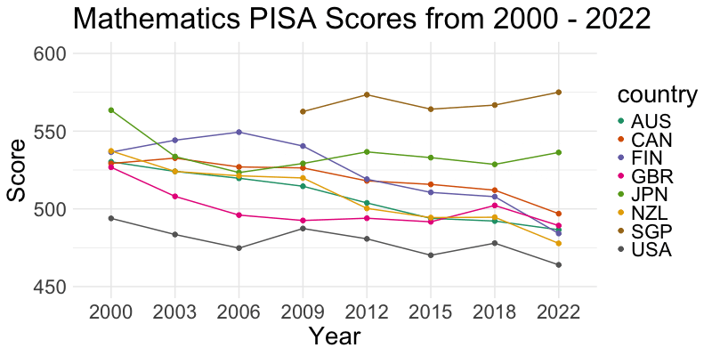

<!-- README.md is generated from README.Rmd. Please edit that file -->

# learningtower 

<!-- badges: start -->


<!-- badges: end -->

The goal of `learningtower` is to provide a user-friendly R package to
provide easy access to a subset of variables from PISA data collected
from the [OECD](http://www.oecd.org/pisa/data/), for the years 2000 -
2018, collected on a three year basis. This is an excellent dataset for
exploring and visualizing data. This dataset can also be used for other
analytically purposes as well as statistical computations.

## What is PISA?

<p align="center">

</p>

The Programme for International Student Assessment (PISA) is an
international assessment measuring student performance in reading,
mathematical and scientific literacy.

PISA assesses the extent to which 15-year-old students have acquired
some of the knowledge and skills that are essential for full
participation in society, and how well they are prepared for lifelong
learning in the areas of reading, mathematical and scientific literacy.

In 2018, PISA involved 79 countries and 600,000+ students worldwide.

Read more about the Programme
[here](http://www.oecd.org/pisa/aboutpisa/).

## Installation

You can install the `learningtower` package from
[CRAN](https://CRAN.R-project.org) with:

``` r
install.packages("learningtower")
```

To install the development version of `learningtower` from
[GitHub](https://github.com/) use:

``` r
devtools::install_github("kevinwang09/learningtower")
```

## Data Description and Usage

The `learningtower` gives access to a subset of variables from PISA data
originally collected and are available from
[OECD](http://www.oecd.org/pisa/data/), for the years 2000 - 2018,
collected on a three year basis.

The `learningtower` package contains mainly three datasets:

-   `student`
-   `school`
-   `countrycode`

This provides us with information about the students scores in
mathematics, reading and science. Their school details, and which
country they are from. Let’s have a look at how these datasets can be
downloaded.

### Student Dataset

The student dataset comprises of the scores from the triennial testing
of 15-year-olds worldwide. In addition, this dataset contains
interesting information on their parents qualifications, family wealth,
gender, and possession of computers, internet, cars, books, rooms,
desks, and similar other variables.

Keeping in mind the package’s size constraints. The package only
includes a portion of student data, called the student subset data, this
subset of student data is available for all the years when the PISA
experiment took place. The full year wise student data set can be
downloaded using the `load_student()` function included in this package.

As an example, we can load the `student` data as follows:

-   The student subset dataset can be loaded as follows

``` r
library(learningtower)

#loading the student subset data for the year 2018
data(student_subset_2018)


head(student_subset_2018)
#> # A tibble: 6 x 22
#> # Groups:   country [1]
#>   year  country school_id student_id mother_educ father_educ gender computer
#>   <fct> <fct>   <fct>     <fct>      <fct>       <fct>       <fct>  <fct>   
#> 1 2018  ALB     800059    805376     ISCED 3A    ISCED 3A    male   yes     
#> 2 2018  ALB     800084    802061     ISCED 3A    ISCED 3B, C female yes     
#> 3 2018  ALB     800093    800674     ISCED 3A    ISCED 2     male   yes     
#> 4 2018  ALB     800278    803561     ISCED 2     ISCED 2     male   yes     
#> 5 2018  ALB     800055    801356     ISCED 3A    ISCED 2     female <NA>    
#> 6 2018  ALB     800279    804382     ISCED 3A    ISCED 3A    male   yes     
#> # ... with 14 more variables: internet <fct>, math <dbl>, read <dbl>,
#> #   science <dbl>, stu_wgt <dbl>, desk <fct>, room <fct>, dishwasher <fct>,
#> #   television <fct>, computer_n <fct>, car <fct>, book <fct>, wealth <dbl>,
#> #   escs <dbl>
```

-   The entire student data can be downloaded as follows:

``` r
#load the entire student data for a single year
student_data_2018 <- load_student(2018)

#load the entire student data for two/three years (2000, 2012, 2018)
student_data_2012_2018 <- load_student(c(2012, 2018))
student_data_2000_2012_2018 <- load_student(c(2000, 2012, 2018))

#load the entire student data
student_data_all <- load_student("all")
```

See `?student_subset_2000` for information pertaining to variables
captured.

### School Dataset

The school dataset comprises school weight and other information such as
the funding distribution of the schools, whether the school is private
or public, the enrollment of boys and girls, the school size, and
similar other characteristics of interest of different schools these
15-year-olds attend throughout the world.

``` r
#loading the school data
data(school)

head(school)
#> # A tibble: 6 x 13
#>   year  country school_id fund_gov fund_fees fund_donation enrol_boys
#>   <fct> <fct>   <fct>        <dbl>     <dbl>         <dbl>      <dbl>
#> 1 2000  ALB     01001          100         0             0       1191
#> 2 2000  ALB     01004           98         1             1        334
#> 3 2000  ALB     01005           91         5             2        403
#> 4 2000  ALB     01010          100         0             0        114
#> 5 2000  ALB     01013            0        50            30        250
#> 6 2000  ALB     01017           95         2             3        771
#> # ... with 6 more variables: enrol_girls <dbl>, stratio <dbl>,
#> #   public_private <fct>, staff_shortage <dbl>, sch_wgt <dbl>,
#> #   school_size <dbl>
```

See `?school` for more information on the different variables present in
the the school dataset.

### Countrycode Dataset

The countrycode dataset contains mapping of the [country ISO code to the
country
name](https://www.oecd.org/pisa/sitedocument/PISA-2015-Technical-Report-Readers-Guide.pdf).
More information on the participating countries can be found
[here](https://www.oecd.org/pisa/aboutpisa/pisa-participants.htm)

``` r
#loading the countrycode data
data(countrycode)

head(countrycode)
#> # A tibble: 6 x 2
#>   country country_name
#>   <chr>   <chr>       
#> 1 AZE     Azerbaijan  
#> 2 ARG     Argentina   
#> 3 AUS     Australia   
#> 4 AUT     Austria     
#> 5 BEL     Belgium     
#> 6 BRA     Brazil
```

See `?countrycode` for more detailed information on the countries that
participated in the PISA experiment.

## Exploring the data

In the `gif` shown below, shows the weighted mean of mathematics scores
of these 15 year old students for a few selected countries, this `gif`
helps us observe changing of the scales over-highlights and the
differences in the means between various countries in the different
years.

<p align="center">

</p>

-   Similarly, you can find more code examples and data visualizations
    for exploring `learningtower` through our vignettes and articles

-   Further data exploration can be found in our articles exploring
    temporal trends
    [here](https://kevinwang09.github.io/learningtower/articles/exploring_time.html).

## Citation

To cite the `learningtower` package, please use:

``` r
citation("learningtower")
#> 
#> To cite package 'learningtower' in publications use:
#> 
#>   Kevin Wang, Paul Yacobellis, Erika Siregar, Sarah Romanes, Kim
#>   Fitter, Giulio Valentino Dalla Riva, Dianne Cook, Nick Tierney and
#>   Priya Dingorkar (2021). learningtower: Organisation for Economic
#>   Co-operation and Development(OECD), Programme for International
#>   Student Assessment (PISA) datasets in an easy-to-use format.
#>   https://kevinwang09.github.io/learningtower/,
#>   https://github.com/kevinwang09/learningtower.
#> 
#> A BibTeX entry for LaTeX users is
#> 
#>   @Manual{,
#>     title = {learningtower: Organisation for Economic Co-operation and Development(OECD), Programme for International Student Assessment (PISA) datasets in an easy-to-use format},
#>     author = {Kevin Wang and Paul Yacobellis and Erika Siregar and Sarah Romanes and Kim Fitter and Giulio {Valentino Dalla Riva} and Dianne Cook and Nick Tierney and Priya Dingorkar},
#>     year = {2021},
#>     note = {https://kevinwang09.github.io/learningtower/, https://github.com/kevinwang09/learningtower},
#>   }
```

## Acknowledgement

The work to make the data available is the effort of several researchers
from Australia, New Zealand and Indonesia, conducted as part of the
[ROpenSci OzUnconf](https://ozunconf19.ropensci.org) held in Sydney, Dec
11-13, 2019.
