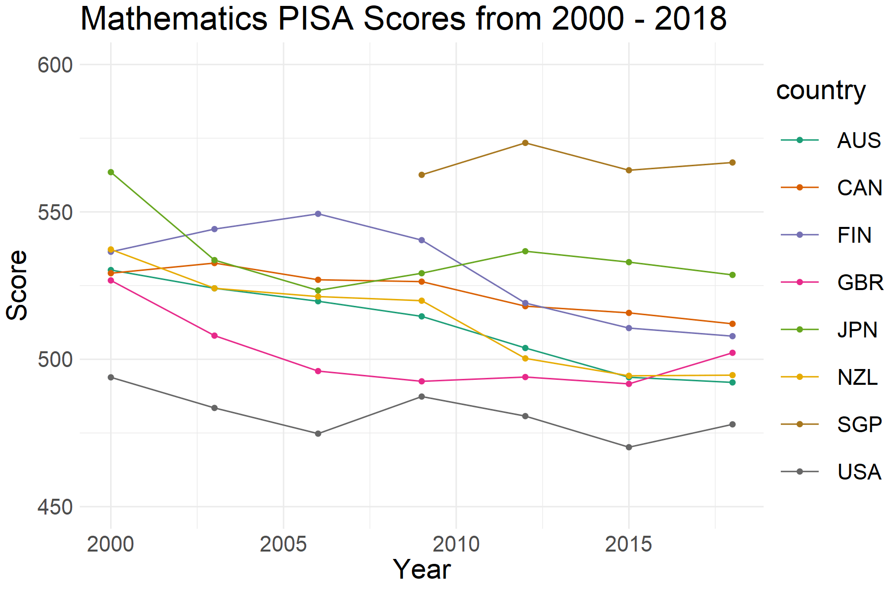

<!-- README.md is generated from README.Rmd. Please edit that file -->

# learningtower 

<!-- badges: start -->

<!-- badges: end -->

The goal of learningtower is to provide a userfriendly R package to
provide easy access to a subset of variables from PISA data collected
from the [OECD](http://www.oecd.org/pisa/data/), for years 2000 - 2018,
collected on a three year basis.

**What is PISA?**

The Programme for International Student Assessment (PISA) is an
international assessment measuring student performance in reading,
mathematical and scientific literacy.

PISA assesses the extent to which 15-year-old students have acquired
some of the knowledge and skills that are essential for full
participation in society, and how well they are prepared for lifelong
learning in the areas of reading, mathematical and scientific literacy.

In 2018, PISA involved 79 countries and 600,000+ students worldwide.

Read more about the Programme
[here](http://www.oecd.org/pisa/aboutpisa/).

## Installation

You can install the development version of learningtower from
[GitHub](https://github.com/) with:

``` r
# install.packages("devtools")
devtools::install_github("ropenscilabs/learningtower")
```

## Usage

The PISA assessment measures responses from individual students and
school principals. A subset of features of these questionnaires can be
found in `student` and `school` respectively (the latter coming soon).
As an example, we can load the `student` data as follows:

``` r
library(learningtower)
data(student)
head(student)
#>   year country school_id student_id mother_educ father_educ gender
#> 1 2000     ALB     01001      00001          NA          NA      1
#> 2 2000     ALB     01001      00003          NA          NA      1
#> 3 2000     ALB     01001      00006          NA          NA      2
#> 4 2000     ALB     01001      00008          NA          NA      1
#> 5 2000     ALB     01001      00011          NA          NA      1
#> 6 2000     ALB     01001      00012          NA          NA      1
#>   computer internet  math science  read stu_wgt country_iso3c country.name
#> 1        4        2 324.4   345.7 397.9    2.16           ALB      Albania
#> 2        1        2    NA   385.8 368.4    2.16           ALB      Albania
#> 3        1        2    NA   327.9 294.2    2.16           ALB      Albania
#> 4        2        2 235.8   341.1 241.5    2.16           ALB      Albania
#> 5        1        2    NA   307.1 287.2    2.16           ALB      Albania
#> 6       NA        2 290.7   277.0 307.8    2.16           ALB      Albania
#>   un.name.en
#> 1    Albania
#> 2    Albania
#> 3    Albania
#> 4    Albania
#> 5    Albania
#> 6    Albania
```

See `?student` for information pertaining to variables captured.

We can get futher information on the country codes in the `countrycode`
data.

``` r
data(countrycode)
head(countrycode)
#>   country_iso3c country_name
#> 1           AZE   Azerbaijan
#> 2           ARG    Argentina
#> 3           AUS    Australia
#> 4           AUT      Austria
#> 5           BEL      Belgium
#> 6           BRA       Brazil
```

## Exploring the data

Changing the scales over-highlights differences in the means between
various countries.



Further data exploration can be found in our vignette exploring temporal
trends
[here](https://ropenscilabs.github.io/learningtower/articles/exploring_time.html).
